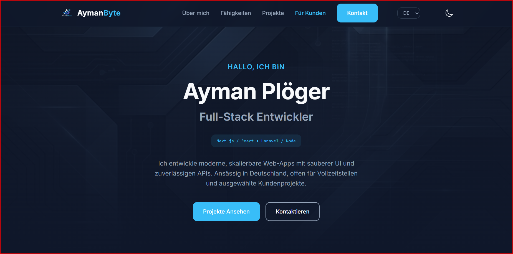

# AymanByte – Portfolio Website

A modern, responsive portfolio website for **Ayman Plöger** (Full-Stack Developer), built with clean HTML/CSS/JavaScript and a focus on performance, clarity, and professional presentation.

## 🌐 Live Demo
- Netlify: https://aymanbyte-portfolio.netlify.app/

## 📄 Pages
- **index.html** — Developer portfolio (about, skills, projects, experience, contact)
- **clients.html** — Client-facing page (services, process, selected work, contact)

## ✨ Features
- Dark / Light mode toggle
- Multi-language UI (EN / DE / AR) with RTL support for Arabic
- Responsive layout (mobile / tablet / desktop)
- Smooth scroll + subtle animations
- Clean UI system with reusable sections and components

## 🧰 Tech Stack
- HTML5
- CSS3 (custom design system with CSS variables)
- JavaScript (Vanilla)
- Ionicons

## 🚀 Run Locally
You can open the project directly in the browser:

1. Open `index.html` with your browser  
   **or**
2. Use VS Code extension **Live Server**:
   - Install *Live Server*
   - Right click `index.html` → **Open with Live Server**

## 📦 Deployment
### GitHub
This project is hosted on GitHub:
- Repo: https://github.com/Ploger1979/portfolio

### Netlify
Recommended deployment via Netlify (Git-based):
- Import the GitHub repo
- Build command: *(empty)*
- Publish directory: `.`

## 📬 Contact
- Email: **aymanploger@gmail.com**
- GitHub: https://github.com/Ploger1979
- Instagram: https://www.instagram.com/ayman.ploeger/
- Facebook: https://www.facebook.com/profile.php?id=61585532606908

---

© 2025 Ayman Plöger — All rights reserved.

